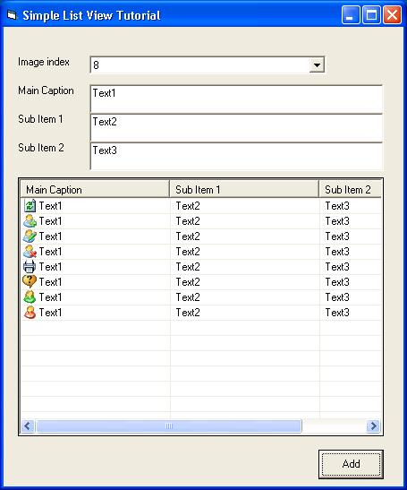



## ListView Tutorial

### Description

This will teach you how to use ListView Control in visual basic. It diplays images in each item displayed. If you are planning to make use of Datagrid for your better presentation, change your mind, make use of listbox, It is more presentable than DataGrid...
 
### More Info
 
Text Entries

Displays an Item to the ListView

             |
---                |---
**Submitted On**   |2008-07-03 05:17:20
**By**             |[Pinkoy Montano](https://github.com/Planet-Source-Code/PSCIndex/blob/master/ByAuthor/pinkoy-montano.md)
**Level**          |Beginner
**User Rating**    |5.0 (15 globes from 3 users)
**Compatibility**  |VB 4\.0 \(16\-bit\), VB 5\.0, VB 6\.0
**Category**       |[Coding Standards](https://github.com/Planet-Source-Code/PSCIndex/blob/master/ByCategory/coding-standards__1-43.md)
**World**          |[Visual Basic](https://github.com/Planet-Source-Code/PSCIndex/blob/master/ByWorld/visual-basic.md)
**Archive File**   |[ListView\_T211923732008\.zip](https://github.com/Planet-Source-Code/pinkoy-montano-listview-tutorial__1-70776/archive/master.zip)

